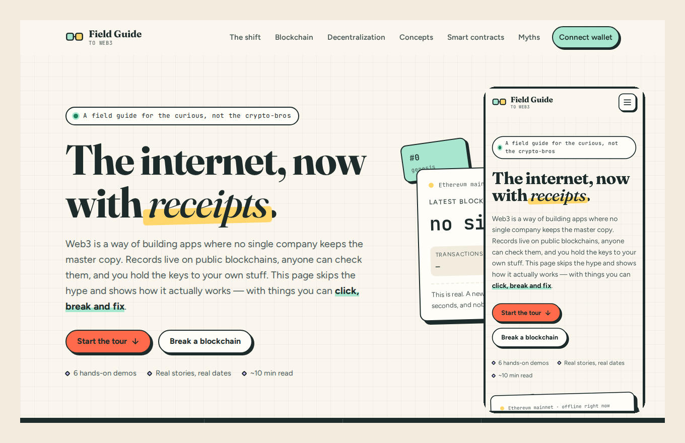
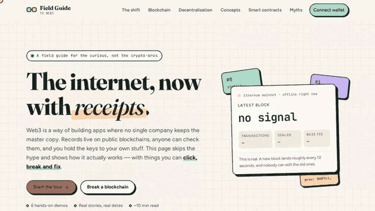

# Web3 Field Guide — the internet, now with receipts

A light, hands-on landing page that explains Web3 to complete beginners. You don't just read about blockchains here: you **break one and repair it**, **switch servers off** to see why decentralization matters, **run a smart contract** step by step and **connect a real wallet**.

**Live site:** https://govindaramakrishna6-eng.github.io/WEB-3-/
**Demo:** [`docs/demo.webm`](docs/demo.webm) (about a minute) · GIF preview below



<details>
<summary>Watch the demo GIF (plays at 2x speed)</summary>



</details>

---

## What's on the page

| # | Section | What you can do | Web3 idea it teaches |
|---|---------|-----------------|----------------------|
| — | **Hero** | Watch a **live Ethereum block** counter, fetched from public nodes every 12 s | Blocks, block time, gas base fee |
| 01 | **The shift** | Switch between Web1, Web2 and Web3 tabs | Read → read/write → read/write/**own** |
| 02 | **Blockchain** | Type into a real SHA-256 hasher, then edit a 4-block chain and **re-mine** it | Hashes, chained blocks, immutability, proof-of-work, nonces |
| 03 | **Decentralization** | Knock computers offline in a client–server network vs a peer-to-peer mesh | No single point of failure, full-copy nodes, network splits |
| 04 | **Vocabulary** | Explore 6 concepts, each with a plain definition, an analogy, a **real dated example** and **the catch** | Cryptocurrency, wallets & keys, gas, NFTs, DAOs, stablecoins & DeFi |
| 04 | **Timeline** | Scroll eight key moments from 2008 to 2022 | History: whitepaper → the Merge |
| 05 | **Smart contracts** | Pick a snack, insert coins and call `buy()` on a vending-machine contract; see it succeed or **revert** | Smart contracts, `require`, reverts, events, gas, receipts |
| 06 | **Myth-busting** | Flip 6 myth cards, take a 5-question quiz | Pseudonymity, self-custody, NFT rights, PoW vs PoS |
| 07 | **Wallet (bonus)** | Connect MetaMask or any browser wallet, see network + balance, **sign a free message**, switch to Sepolia | Wallets, public addresses, signatures, testnets |

### Real examples used (and why they're there)

I wanted every concept to come with something that actually happened, with a date, not a made-up "imagine Alice…" scenario:

- **Bitcoin genesis block (3 Jan 2009)** with its embedded *Times* headline: shows immutability.
- **Bitcoin Pizza Day (22 May 2010)**: 10,000 BTC for two pizzas, the first well-known crypto purchase.
- **Facebook outage (4 Oct 2021)**: one config error took Facebook, Instagram and WhatsApp down for about six hours. A clear case for decentralization.
- **The DAO hack (2016)**: a smart contract bug drained ~3.6M ETH, and the chain was forked to reverse it ("code is law" cuts both ways).
- **CryptoKitties (Dec 2017)**: congested Ethereum and pushed gas fees up.
- **Beeple at Christie's (Mar 2021)**: a $69.3M NFT sale.
- **ConstitutionDAO (Nov 2021)**: ~$47M from 17,000+ people in a week, outbid by Ken Griffin.
- **Bitfinex recovery (2022)**: ~94,000 stolen BTC traced on-chain, which busts the "crypto is untraceable" myth.
- **James Howells' landfill hard drive**: ~8,000 BTC lost because nobody can reset a private key.
- **TerraUSD collapse (May 2022)**: why "stable" depends on the backing.
- **The Merge (15 Sep 2022)**: Ethereum's switch to proof-of-stake cut its energy use by ~99.95%.

Each concept also has a **"the catch"** box. Beginners deserve the risks as well as the pitch.

---

## Design choices

Most Web3 sites use dark backgrounds, neon gradients and glassmorphism. This one is deliberately different: it's styled like a **printed field guide**.

| Token | Colour | Used for |
|-------|--------|----------|
| Paper | `#FAF6EE` | Page background (with a faint graph-paper grid) |
| Ink | `#1D2B2A` | Text, borders, offset "sticker" shadows |
| Mint | `#A8E6CF` | Valid / success / primary accents |
| Tomato | `#FF6B4A` | Calls to action, broken blocks, warnings |
| Butter | `#FFD66B` | Highlights, coins, notes |
| Lilac | `#C8B6FF` · Sky `#9ED3F0` | Secondary accents |

- **Type:** *Fraunces* (editorial serif headings), *Figtree* (readable body text), *JetBrains Mono* (hashes, code, labels).
- **Visual language:** thick ink outlines, hard offset shadows, slightly rotated "sticker" cards and a highlighter underline on the hero.
- **Motion:** scroll reveals, a floating live card, animated mining and network flow. All of it is switched off under `prefers-reduced-motion`.

## Responsiveness & accessibility

- Fluid type with `clamp()`, CSS Grid layouts that collapse at **1024px**, **860px** and **560px**. Tested at 390px (phone) and 1366px (laptop) with no horizontal page scroll.
- Semantic landmarks, a skip link and one `h1` with a logical heading order.
- Keyboard-friendly tabs (arrow keys, Home/End), with ARIA `tablist`/`tab`/`tabpanel` roles and `aria-selected`.
- Network nodes and flip cards are focusable buttons with `aria-pressed`. Live regions announce chain and network status changes.
- Visible focus rings, and colour is never the only signal (badges say "valid"/"broken").
- Content stays visible if JavaScript is off: reveal animations only apply when a `js` class is present.

---

## Wallet integration (bonus)

`js/wallet.js` uses the standard wallet APIs and needs no libraries:

- **EIP-6963** multi-wallet discovery (MetaMask, Rabby, Coinbase Wallet, etc. can all announce themselves), with a fallback to `window.ethereum`.
- **EIP-1193** requests: `eth_requestAccounts`, `eth_chainId`, `eth_getBalance`.
- **`personal_sign`** for a free "prove you own this address" signature (the idea behind *Sign-In with Ethereum*).
- **`wallet_switchEthereumChain` / `wallet_addEthereumChain`** for one-click Sepolia testnet.
- Listens for `accountsChanged` and `chainChanged`, and shows friendly errors for rejected requests (code `4001`), pending requests (`-32002`) and unknown chains (`4902`).
- With no wallet installed it links to MetaMask, and on mobile it offers a deep link that opens the page in the MetaMask app.

The page never asks for or stores keys, and it never sends a transaction.

---

## Tech & project structure

Plain **HTML, CSS and vanilla JavaScript**, with no framework and no build step. Every script is a small, focused file.

```
.
├── index.html              # All content and semantic structure
├── css/
│   └── styles.css          # Design tokens, components, responsive rules
├── js/
│   ├── main.js             # Nav, scroll progress, reveals, counters, tabs helper
│   ├── live-block.js       # Live Ethereum block via public JSON-RPC (with fallbacks)
│   ├── sha256.js           # Small synchronous SHA-256 (verified against Node's crypto)
│   ├── chain-demo.js       # Hash playground + break/re-mine the chain
│   ├── network-demo.js     # Client–server vs peer-to-peer knockout (SVG)
│   ├── learn.js            # Concept explorer, myth cards, quiz
│   ├── contract-demo.js    # Vending-machine smart contract simulation
│   └── wallet.js           # EIP-6963 / EIP-1193 wallet connection
├── assets/favicon.svg
├── docs/                   # Demo video, GIF and preview image
└── .github/workflows/pages.yml   # GitHub Pages deployment
```

## Run it locally

```bash
git clone https://github.com/govindaramakrishna6-eng/WEB-3-.git
cd WEB-3-
python3 -m http.server 8000     # or: npx serve .
# open http://localhost:8000
```

You can also open `index.html` directly. Everything works except wallet connection, because wallets only inject into pages served over `http(s)`.

## Deploy

The repo includes a GitHub Actions workflow that publishes the site to GitHub Pages on every push to `main`:

1. Repository **Settings → Pages → Build and deployment → Source: GitHub Actions**.
2. Merge to `main` (or run the workflow manually from the **Actions** tab).
3. The site goes live at `https://govindaramakrishna6-eng.github.io/WEB-3-/`.

Netlify and Vercel also work with zero config, since this is a static site.

---

## Further reading

- [ethereum.org: What is Web3?](https://ethereum.org/en/web3/)
- [Bitcoin: A Peer-to-Peer Electronic Cash System](https://bitcoin.org/bitcoin.pdf), the original whitepaper
- [Anders Brownworth's blockchain demo](https://andersbrownworth.com/blockchain/), which inspired the break-the-chain section

*Educational project. Nothing here is financial advice.*
